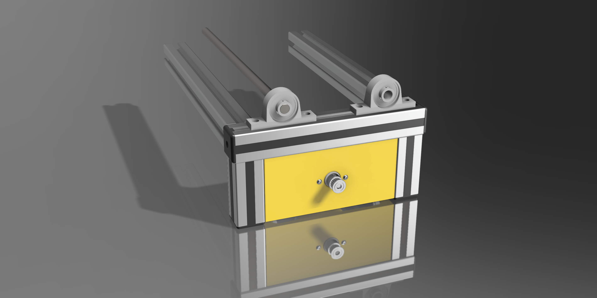

# tamburcu S3009
# Silindirik Tambur Makinesi

Bu proje, 2 mil üzerinde dönen silindirik bir tambur makinesinin açık kaynak tasarımını içermektedir. Polisaj, aşındırma ve benzeri DIY işlemleri için tasarlanmış bu makine, evde kullanım amaçlı olup tamamen değiştirilebilir ve geliştirilebilir yapıdadır.

## ℹ️ Genel Özellikler ℹ️

- **Güç Kaynağı**: DC⎓12-20V, 4A
- **Maksimum Devir**: 5000 RPM
- **Kontrol Sistemi**: Ayarlanabilir potansiyometre
- **Güvenlik Elemanları**: Resetlenebilir sigorta
- **Göstergeler**: Açık/Kapalı ışığı, Motor LED göstergesi
- **Tambur**: 2 mil üzerinde dönen silindirik yapı

## ⚠️ Uyarı ⚠️

Bu makine DIY (Kendin Yap) prensibiyle, kişisel kullanım amacıyla tasarlanmıştır ve ticari veya endüstriyel amaçlı kullanım için uygun değildir. Profesyonel standartlara ve sertifikalara sahip değildir. **Kullanımdan doğabilecek risklerin sorumluluğu kullanıcıya aittir.**

## Malzeme Listesi

Projeyi oluşturmak için gereken temel malzemeler:

| Parça | Miktar | Açıklama |
|-------|--------|----------|
| DC Motor | 1 | RS-775 24V 15000Rpm |
| Potansiyometre | 1 | 100k Ohm |
| Resetlenebilir Sigorta | 1 | 5A |
| Açma/Kapama Düğmesi | 1 | DPST tipi |
| LED | 2 | Güç ve motor göstergeleri için |
| Mil | 2 | 10mm çap, Krom Kaplı İndüksiyonlu Mil|
| Rulmanlı Mil Yatağı | 4 | UP000 / KP000 tipi |
| Konnektör | 1 | GX-12 3P Dişi-Erkek 3 Pinli Mike Konnektör  |
| Kablolar  | Çeşitli | 14-18 AWG |
| Güç Adaptörü | 1 | 20V, 4.5A |

Detaylı malzeme listesi için [hardware/bom.csv](hardware/bom.csv) dosyasına bakınız.

## Kurulum

1. `hardware/3d-models` klasöründeki STL dosyalarını kullanarak gerekli parçaları 3B yazıcıda basın
2. `hardware/schematics` klasöründeki devre şemasını takip ederek elektronik bileşenleri bağlayın
3. Mekanik parçaları montaj talimatlarına göre birleştirin
4. `firmware/src` klasöründeki kodu Arduino veya benzer bir mikrodenetleyiciye yükleyin

Detaylı montaj talimatları için [docs/assembly-guide.md](docs/assembly-guide.md) dosyasına bakınız.

## Kullanım

1. Makineyi düz ve sağlam bir zemine yerleştirin
2. Güç kablosunu bağlayın
3. Potansiyometreyi minimum konuma getirin
4. Açma/kapama düğmesine basın
5. Potansiyometre ile dönüş hızını ayarlayın
6. İşlem bittiğinde potansiyometreyi minimum konuma getirip makineyi kapatın

Detaylı kullanım talimatları için [docs/user-manual.md](docs/user-manual.md) dosyasına bakınız.

## Güvenlik Önlemleri

- Kullanım öncesi tamburun sağlam bir şekilde kapatıldığından emin olun
- Çalışırken tamburdan ve hareketli parçalardan ellerinizi ve giysilerinizi uzak tutun
- Makineyi gözetimsiz çalışır halde bırakmayın
- Her kullanımdan önce tamburu çatlak veya hasar açısından kontrol edin
- Sürekli 1 saatten fazla çalıştırmayın
- Çocukların erişemeyeceği yerlerde kullanın ve saklayın

## Sorun Giderme

Yaygın sorunlar ve çözümleri için [docs/troubleshooting.md](docs/troubleshooting.md) dosyasına bakınız.

## Özelleştirme ve Geliştirmeler

Bu projenin temel amacı, kullanıcıların kendi ihtiyaçlarına göre makineyi özelleştirebilmesidir. Bazı özelleştirme fikirleri:

- Tambur boyutunu değiştirme
- Farklı motor tipleri kullanma
- Dijital hız kontrolü ekleme
- Zamanlayıcı işlevi ekleme
- Sıcaklık sensörü ekleme
- Mobil uygulama uyumluluğu
- Çeşitli durumlar için alarm

## Katkıda Bulunma

1. Bu repo'yu fork edin
2. Yeni bir özellik dalı oluşturun (`git checkout -b feature/amazing-feature`)
3. Değişikliklerinizi commit edin (`git commit -m 'Add some amazing feature'`)
4. Dalınıza push edin (`git push origin feature/amazing-feature`)
5. Pull Request açın

Daha fazla bilgi için [CONTRIBUTING.md](CONTRIBUTING.md) dosyasına bakınız.

## ⚠️Lisans⚠️

Bu proje [Creative Commons Attribution-NonCommercial 4.0 International (CC BY-NC 4.0)](https://creativecommons.org/licenses/by-nc/4.0/) lisansı altında dağıtılmaktadır.

Bu lisans kapsamında:
- Projeyi kopyalayabilir ve yeniden dağıtabilirsiniz
- Projeyi uyarlayabilir, düzenleyebilir ve geliştirebilirsiniz
- Orijinal projeye ve yaratıcısına uygun atıfta bulunmanız gerekir
- Projeyi ticari amaçlarla kullanamazsınız

## ⚠️⚠️⚠️ Ticari kullanım için proje sahibinden özel izin almanız gerekmektedir. ⚠️⚠️⚠️

## İletişim

Proje Linki: [https://github.com/kullanici/tambur-makinesi](https://github.com/soyluoltu/tamburcu)

---

Bu belge, projenin ayrılmaz bir parçasıdır ve ileride başvurmak üzere saklanmalıdır.
