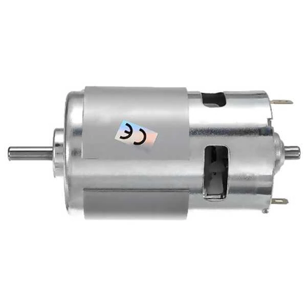
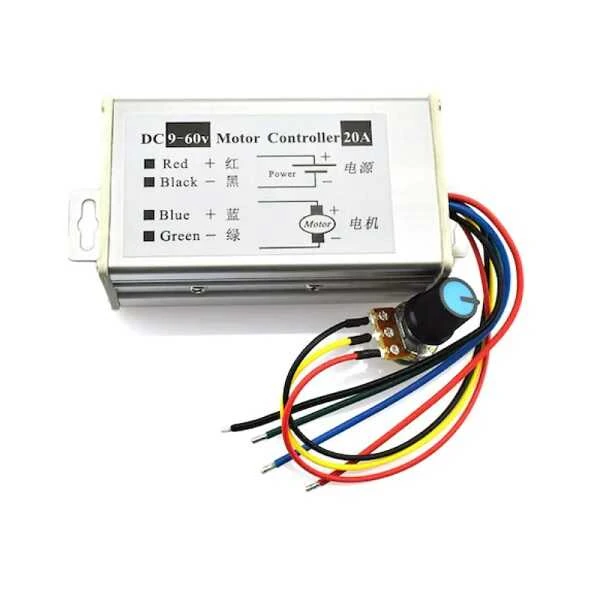
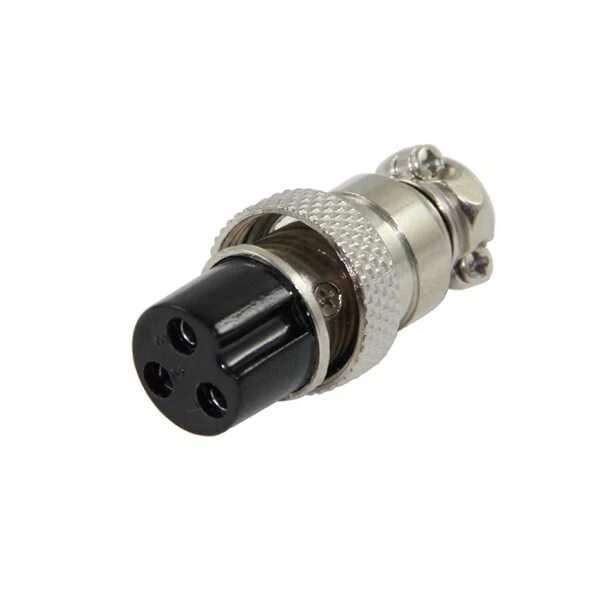
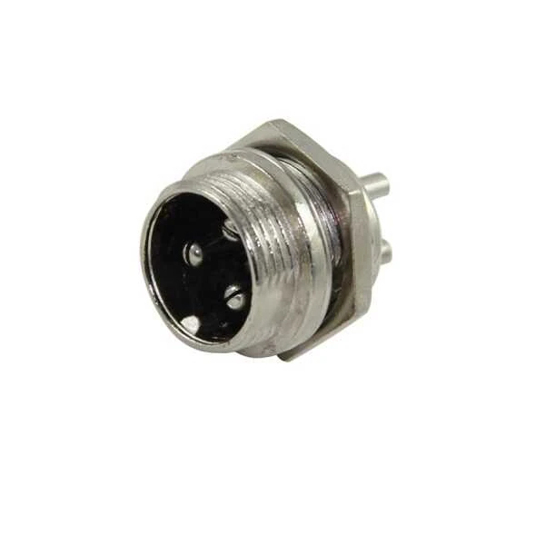

# Tambur Makinesi Montaj Rehberi

Bu rehber, Tambur Makinesi'nin doğru şekilde montajı için adım adım talimatlar içermektedir. Tüm parçaları tam ve doğru bir şekilde monte etmek, cihazın güvenli ve verimli çalışması için esastır.

## 📋 Gerekli Malzemeler

### Parçalar

Montaja başlamadan önce aşağıdaki parçaların tam olduğundan emin olun:

| Parça | Adet | Açıklama |
|-------|------|----------|
| Ana Gövde | 1 | 3B basılmış veya hazır gövde |
| Üst Kapak | 1 | 3B basılmış |
| Tambur | 1 | 3B basılmış silindirik tambur |
| Tambur Kapağı | 1 | 3B basılmış |
| Mil | 2 | 8mm çap, paslanmaz çelik |
| Rulman | 4 | 608ZZ tipi rulman |
| Motor | 1 | DC motor (20V, 4.5A) |
| Motor Montaj Braketi | 1 | 3B basılmış |
| Potansiyometre | 1 | 10k Ohm, B-tipi |
| Potansiyometre Düğmesi | 1 | 3B basılmış veya hazır |
| Güç Düğmesi | 1 | SPST tipi |
| Resetlenebilir Sigorta | 1 | 5A |
| LED (Yeşil) | 1 | Güç göstergesi |
| LED (Mavi) | 1 | Motor göstergesi |
| Elektronik Kart | 1 | Hazır veya kendiniz ürettiğiniz |
| Güç Girişi Soketi | 1 | DC barrel jack |
| Kablolar | Çeşitli | Farklı renk ve uzunluklarda |
| Vida Seti | 1 | Çeşitli boyutlarda |

### Aletler

| Alet | Kullanım Amacı |
|------|----------------|
| Yıldız Tornavida | Vidaların sıkılması |
| Allen Anahtarlar | Set vida montajı |
| Küçük Pense | Kabloların tutulması ve kesilmesi |
| Kablo Soyucu | Kablo izolasyonlarının soyulması |
| Lehim İstasyonu | Elektronik bağlantıların lehimlenmesi |
| Lehim | Elektronik bağlantılar için |
| Isı Tabancası/Çakmak | Isı büzüşmeli makaron için |
| Isı Büzüşmeli Makaron | Kablo bağlantılarının izolasyonu |
| Multimetre | Bağlantıların test edilmesi |
| Cetvel | Ölçü kontrolü |
| Makas | Kablo ve makaron kesimi |
| Koruyucu Gözlük | Montaj sırasında güvenlik |
| Çalışma Eldiveni | Keskin kenarlardan korunma |

## Resimleri ile Parçalar
### Motor: RS775 DC Motor 24V 15000Rpm

### Motor Sürücüsü: PWM DC Motor Hız Kontrol Modülü 9-60V 20A

### Güç Girişi Adaptör Tarafı: MAYK Fiş - 3P Dişi

### Güç Girişi Cihaz Tarafı: MAYK Fiş 3P Erkek Şase

### Güç Girişi Cihaz Tarafı: MAYK Fiş 3P Erkek Şase

## 🔩 Montaj Öncesi Hazırlık

### 3B Basılmış Parçaların Hazırlanması

1. Tüm 3B basılmış parçaları kontrol edin:
   - Baskı kalitesi iyi mi?
   - Eksik veya yarım basılmış bölüm var mı?
   - Destek malzemeleri tamamen temizlenmiş mi?

2. 3B basılmış parçaları hazırlayın:
   - Tüm destek malzemelerini temizleyin
   - Pürüzlü kenarları zımpara ile düzeltin
   - Vida deliklerini kontrol edin ve gerekirse temizleyin
   - Mil yuvalarının doğru boyutta olduğunu kontrol edin

### Elektronik Komponentlerin Hazırlanması

1. Tüm elektronik bileşenleri kontrol edin:
   - Hasar var mı?
   - Doğru değer ve özelliklere sahip mi?

2. Elektronik devre kartını hazırlayın:
   - Hazır bir devre kartı kullanıyorsanız, bağlantı noktalarını kontrol edin
   - Kendi devre kartınızı hazırlıyorsanız, şemaya göre lehimleyin

3. Kabloları hazırlayın:
   - Gereken uzunluklarda kesin
   - Uçlarını soyun
   - Gerekirse konektörler takın

## 🛠️ Mekanik Montaj

### Adım 1: Rulmanların Yerleştirilmesi

1. 4 adet 608ZZ rulmanı ana gövde üzerindeki yuvalara yerleştirin:
   - Rulmanların düzgün oturduğundan emin olun
   - Zorlamayın, tam olarak oturmalıdır
   - Gerekirse hafifçe bir çekiç ve plastik/ahşap parça kullanarak yerleştirin

2. Rulmanların serbestçe döndüğünü kontrol edin

### Adım 2: Motor Montajı

1. Motor montaj braketini ana gövdeye monte edin:
   - Verilen vidaları kullanın
   - Aşırı sıkmayın, plastik çatlayabilir

2. Motoru braket üzerine yerleştirin:
   - Motor milinin doğru konumda olduğundan emin olun
   - Verilen vidaları kullanarak sabitleyin
   - Motorun sağlam bir şekilde monte edildiğinden emin olun

### Adım 3: Millerin Yerleştirilmesi

1. Paslanmaz çelik milleri rulmanlara yerleştirin:
   - Milleri temiz tutun, yağlı ellerle dokunmayın
   - Milleri düz bir şekilde iterek yerleştirin
   - Millerin her iki tarafta da eşit uzunlukta çıkıntı yapmasını sağlayın

2. Millerin serbestçe döndüğünü kontrol edin:
   - Her mili manuel olarak döndürün
   - Takılma veya sürtünme olmamalıdır

### Adım 4: Tamburun Yerleştirilmesi

1. Tamburu miller üzerine dikkatlice yerleştirin:
   - Tamburun mil yuvalarını miller ile hizalayın
   - Nazikçe iterek tamburu millere oturtun
   - Tamburun her iki tarafta da eşit mesafede olmasını sağlayın

2. Tambur kapağını takın:
   - Kapağı tambur üzerine yerleştirin
   - Kilitleme mekanizmasının tam olarak oturduğundan emin olun
   - Kapağın sağlam bir şekilde kilitlendiğini kontrol edin

3. Tamburun serbestçe döndüğünü kontrol edin:
   - Tamburu elinizle döndürün
   - Takılma veya sürtünme olmamalıdır

## 🔌 Elektronik Montaj

### Adım 1: Kontrol Paneli Hazırlığı

1. Üst kapağa kontrol elemanlarını monte edin:
   - Potansiyometre: Verilen somun ve pul ile sabitleyin
   - Güç düğmesi: Yuvasına yerleştirin ve somun ile sabitleyin
   - LED'ler: Yuvalarına yerleştirin ve arkadan sabitleyin
   - Resetlenebilir sigorta: Yerine yerleştirin ve sabitleyin
   - DC güç girişi: Yuvasına yerleştirin ve sabitleyin

2. Potansiyometre düğmesini takın:
   - Potansiyometrenin şaftına düğmeyi yerleştirin
   - Set vidası ile sabitleyin
   - Düğmenin serbestçe döndüğünü kontrol edin

### Adım 2: Elektronik Bağlantılar

#### Güç Devresi

1. DC güç girişinden gelen kabloları bağlayın:
   - Pozitif (genellikle kırmızı) kabloyu resetlenebilir sigortaya bağlayın
   - Negatif (genellikle siyah) kabloyu ortak negatif hatta bağlayın

2. Resetlenebilir sigortadan güç düğmesine bağlantı yapın

3. Güç düğmesinden elektronik karta bağlantı yapın

#### Motor Kontrol Devresi

1. Elektronik karttan motora giden bağlantıları yapın:
   - Potansiyometre bağlantılarını yapın (3 tel)
   - Motor güç bağlantılarını yapın (2 tel)
   - LED bağlantılarını yapın (her biri için 2 tel)

2. Tüm kabloları düzenli şekilde yerleştirin:
   - Kablo bağı kullanarak kabloları gruplandırın
   - Hareketli parçalardan uzak tutun
   - Kısa devre olabilecek bölgeleri izole edin

### Adım 3: Elektronik Test

1. Güç bağlantısını yapmadan önce:
   - Tüm bağlantıları gözle kontrol edin
   - Multimetre ile kısa devre kontrolü yapın
   - Bağlantıların sağlamlığını kontrol edin

2. Güç adaptörünü bağlayın ve temel testleri yapın:
   - Güç düğmesini açın, yeşil LED yanmalı
   - Potansiyometreyi çevirin, mavi LED yanmalı ve parlaklığı değişmeli
   - Motor dönüşünü kontrol edin

## 🧪 Final Montaj ve Test

### Adım 1: Üst Kapağın Montajı

1. Tüm kabloların düzgün yerleştirildiğinden emin olun
2. Üst kapağı ana gövde üzerine yerleştirin
3. Verilen vidalarla sabitleyin (aşırı sıkmayın)
4. Tüm kontrol elemanlarının erişilebilir olduğunu kontrol edin

### Adım 2: Fonksiyon Testi

1. Güç adaptörünü bağlayın
2. Güç düğmesine basın ve yeşil LED'in yandığını kontrol edin
3. Potansiyometreyi minimum konumdan başlayarak yavaşça çevirin
4. Motor ve tamburun düzgün çalıştığını kontrol edin
5. Farklı hız ayarlarında çalışmayı kontrol edin
6. Tambur kapağının güvenliğini kontrol edin

### Adım 3: Güvenlik Kontrolü

1. Tüm vidaların sıkı olduğunu kontrol edin
2. Tüm kabloların güvenli ve izole edilmiş olduğunu kontrol edin
3. Tambur kapağının düzgün kapandığını ve kilitlendiğini kontrol edin
4. Resetlenebilir sigortanın düzgün çalıştığını kontrol edin
5. Havalandırma deliklerinin açık olduğunu kontrol edin

## 🔍 Montaj Sorun Giderme

| Sorun | Olası Neden | Çözüm |
|-------|-------------|-------|
| Rulmanlar yuvaya oturmuyor | Yuva boyutu uyumsuz | Yuvaları hafifçe zımparalayın veya genişletin |
| Miller takılıyor | Rulman hizalama sorunu | Rulmanları yeniden yerleştirin |
| Tambur millere oturmuyor | Mil yuvaları yanlış boyutta | Yuvaları hafifçe genişletin |
| Motor çalışmıyor | Bağlantı hatası | Bağlantıları kontrol edin ve düzeltin |
| LED'ler yanmıyor | Ters bağlantı | LED polaritesini kontrol edin |
| Potansiyometre çalışmıyor | Bağlantı hatası | Potansiyometre bağlantılarını kontrol edin |
| Üst kapak oturmuyor | Kablo karışıklığı | Kabloları düzenli yerleştirin |
| Aşırı titreşim | Dengesiz tambur | Tamburun dengeli yerleştirildiğinden emin olun |

## 📏 Özel Ayarlar ve Modifikasyonlar

### Tambur Boyutu Modifikasyonu

Farklı boyutta tambur kullanmak istiyorsanız:

1. Uygun STL dosyasını indirin veya kendi tasarımınızı yapın
2. Tamburu 3B yazıcıda basın
3. Mil yuvalarının düzgün hizalandığından emin olun
4. Standart montaj adımlarını izleyin

### Motor Gücü Ayarı

Daha güçlü veya daha düşük güçlü motor kullanmak istiyorsanız:

1. Motor braketinin uyumluluğunu kontrol edin
2. Elektronik kartın motor gücüne uygun olduğundan emin olun
3. Gerekirse güç kaynağını değiştirin

### Dijital Kontrol Yükseltmesi

Arduino veya benzer bir mikrodenetleyici ile dijital kontrol eklemek istiyorsanız:

1. Uygun Arduino modelini seçin
2. Motor sürücü devresi tasarlayın
3. Potansiyometre yerine dijital kontrol bağlantıları yapın
4. Firmware'i yükleyin
5. Üst kapakta gerekli modifikasyonları yapın

## 📋 Montaj Sonrası Kontrol Listesi

Her montaj sonrası aşağıdaki kontrolleri yapın:

- [ ] Tüm vidalar sıkı mı?
- [ ] Tambur düzgün dönüyor mu?
- [ ] Motor düzgün çalışıyor mu?
- [ ] LED'ler yanıyor mu?
- [ ] Potansiyometre düzgün çalışıyor mu?
- [ ] Tambur kapağı güvenli bir şekilde kilitleniyor mu?
- [ ] Resetlenebilir sigorta erişilebilir mi?
- [ ] Güç bağlantısı sağlam mı?
- [ ] Cihaz dengeli duruyor mu?
- [ ] Anormal ses veya titreşim var mı?

## 🛡️ Güvenlik Hatırlatmaları

- Elektronik bileşenlerle çalışırken her zaman güç kaynağını çıkarın
- Keskin kenarlar ve aletlerle çalışırken dikkatli olun
- Lehimleme sırasında uygun havalandırma sağlayın
- 3B basılmış parçaların keskin kenarlarına dikkat edin
- Motor ve elektronik bileşenlerin polaritesine dikkat edin
- Montaj sırasında koruyucu gözlük kullanın
- Çocukların erişemeyeceği bir ortamda montaj yapın
- Montaj tamamlandıktan sonra tüm güvenlik kontrollerini yapın

---

Bu montaj rehberi, Tambur Makinesi'nin doğru bir şekilde monte edilmesi için temel adımları içermektedir. Montaj sırasında herhangi bir sorunla karşılaşırsanız veya daha fazla bilgiye ihtiyaç duyarsanız, lütfen teknik destek için iletişime geçin.

**SON GÜNCELLEME**: 16.03.2025